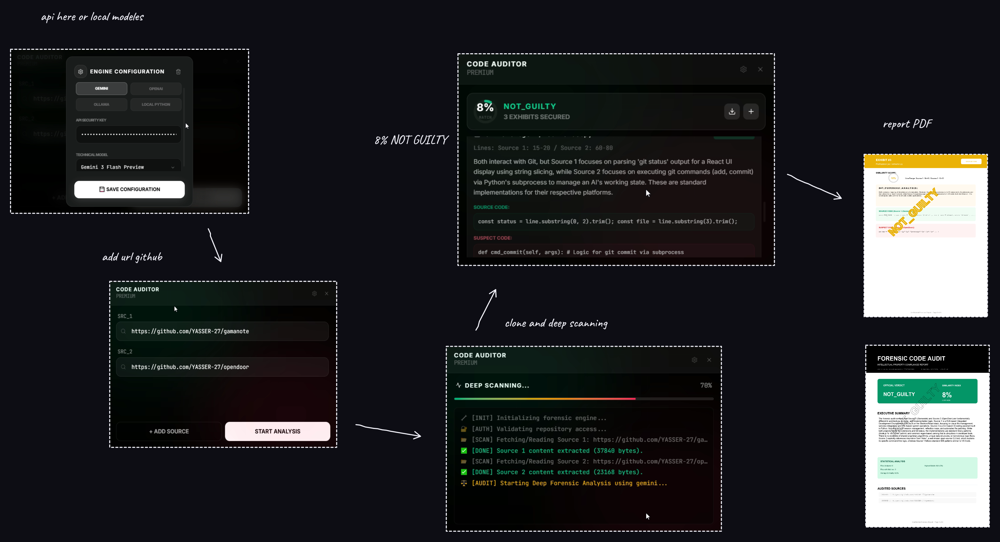
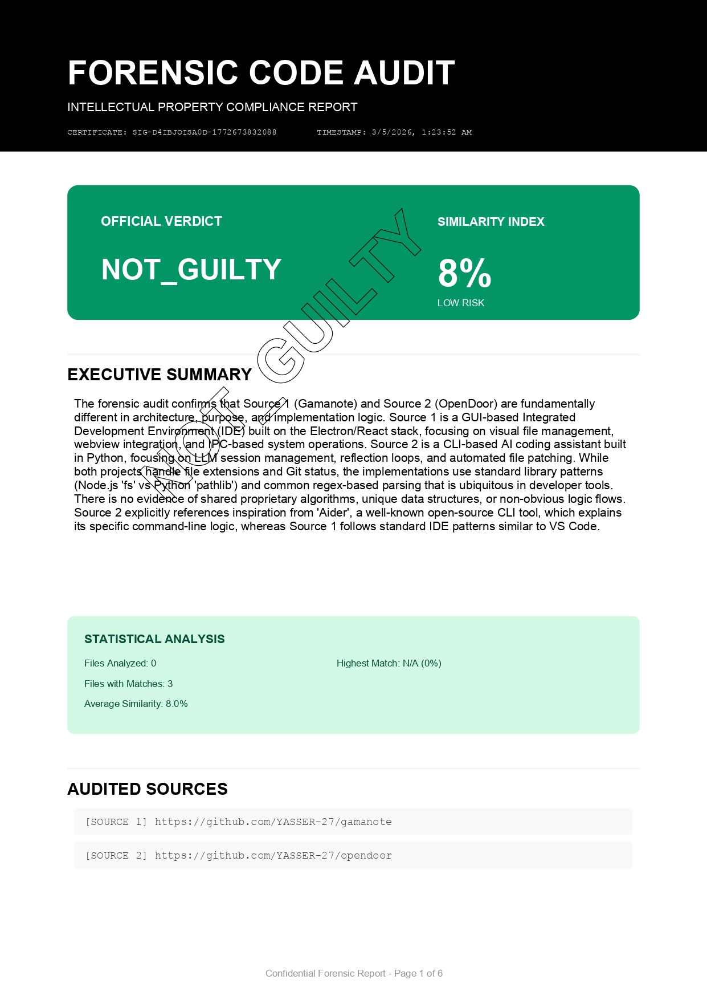

<p align="center">
  
  <br>
  <b>code-auditor</b>
</p>
# Code Auditor - The Just Judge ⚖️


Code Auditor is a premium forensic code auditing tool designed to detect logic plagiarism, intellectual property theft, and code similarities across different programming languages. By viewing the code through an abstract, algorithmic lens rather than just textual matching, it provides an unbiased and highly accurate verdict ("The Judgment").


Supported by powerful AI models like Gemini, OpenAI, OpenRouter, Ollama (Local AI), and a fallback Local Python Engine, Code Auditor generates professional PDF reports detailing every piece of forensic evidence.


---
##  How It Works


Code Auditor acts as an advanced "Just Judge" performing a deep logic comparison between two sets of source code (Original vs. Suspect).
It follows strict forensic instructions:


1. **Ignores purely textual overlaps:** Variable names, project names, and common framework boilerplates are disregarded.
2. **Focuses on algorithmic logic:** Understands custom logic flows, unique data transformations, and non-standard architectural choices.
3. **Cross-language comparison:** Capable of detecting stolen logic even if the suspect code was translated from Python to JavaScript or vice versa.
4. **Verdicts & Evidence:** Returns a conclusive verdict indicating whether the suspect code is `GUILTY`, `SUSPICIOUS`, or `NOT_GUILTY`, backed by detailed technical explanations and line-by-line evidence.


## 🛠️ Built With (Technology Stack)


This desktop application was built using modern web and desktop technologies:
- **TypeScript & JavaScript**
- **Electron:** Cross-platform desktop application framework.
- **React & Vite:** High-performance frontend UI framework.
- **TailwindCSS:** For premium, modern UI styling.
- **SQLite (better-sqlite3):** Local, on-device database for storing audit histories securely.
- **AI Integrations:** Google Gemini API, OpenAI API, OpenRouter, Ollama, and a Local Python Diff Engine.
- **jsPDF & Recharts:** For professional PDF report generation and data visualization.

> 
> 

## 📖 User Guide


### 1. Setting Up the AI Engines
- Launch **Code Auditor**.
- Navigate to the **Settings** or **Engines** panel.
- Choose your preferred AI Provider (Gemini, OpenAI, OpenRouter, Ollama, or Local Python fallback).
- If using an API-based provider (like Gemini or OpenAI), enter your required API Key.
- If using **Ollama**, ensure the Ollama service is running locally (default: `http://localhost:11434`).
### 2. Performing an Audit
- Paste the **Original Code** into the left source panel.
- Paste the **Suspect Code** into the right target panel.
- Click **Start Audit**.
- The "Just Judge" AI will analyze the code blocks based on deep algorithmic structures rather than basic text matching.
### 3. Reviewing the Verdict (The Judgment)
The AI returns a structured forensic evaluation with the following data:
- **Similarity Score:** An accurate percentage based on actual logic overlap.
- **Verdict (The Judgment):**
  - `GUILTY`: Definite code theft or severe logic plagiarism detected.
  - `SUSPICIOUS`: High overlapping logic, possibly modified or partially copied.
  - `NOT_GUILTY`: Independent implementations, safe logic.
- **Forensic Details:** A comprehensive explanation justifying the ruling based on logic and patterns.
- **Findings:** Side-by-side code comparisons isolating exact overlaps with technical proofs.


### 4. Generating Reports
Once the audit is complete, you can generate and download a **Professional PDF Report** containing all the forensic evidence to present or archive for official reviews.

---

| report | report | report |
|---|---|---|
|| .jpg) | .jpg) |
| .jpg) | .jpg) | .jpg) |

---

## 🛠 Installation
1. **Clone the repository:**
   ```bash
   git clone https://github.com/YASSER-27/code-auditor.git
   cd code-auditor
   ```
2. **Install dependencies:**
   ```bash
   npm install
   ```


3. **Rebuild Native Modules (Required for SQLite in Electron):**
   ```bash
   npm run postinstall
   ```


4. **Run the Application in Development Mode:**
   ```bash
   npm run dev:electron
   ```


5. **Build for Production (Windows `.exe`):**
   ```bash
   npm run dist
   ```
   The installer will be generated in the `dist-electron` folder.
## 📄 License


This project is licensed under the **GNU General Public License v3.0 (GPL-3.0)**. See the [LICENSE](./LICENSE) file for more details.


## 👨‍💻 Author


Developed by **[YASSER-27](https://github.com/YASSER-27)**.

**Done! ✅**